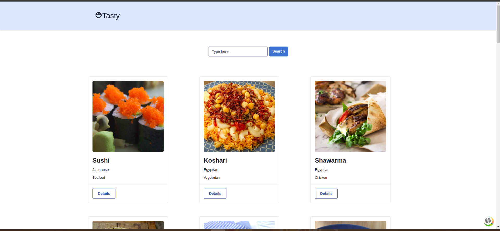
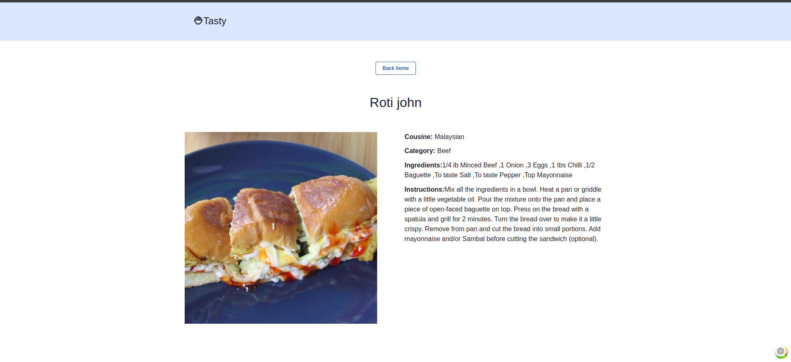

# Project

Tasty is a simple app in ReactJS that show a list of recepies.

## Live demo

Link : [https://peaceful-muffin-7ac6da.netlify.app/](https://peaceful-muffin-7ac6da.netlify.app/)

## Techologies

- React Routing
- React Icons
- Axios
- Chakra UI
- React Query
- Tailwind

## Features

- Search recepies by name
- Get a detail info of single recepie

## Run The App Locally

```sh
npm run install && npm run dev
```

## API Documentation

[Meals API](https://www.themealdb.com/api.php)

## Screenshots

### Landing page

## 

### Single meal page

## 
